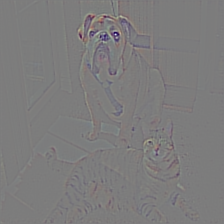
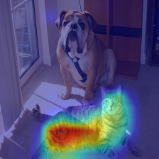
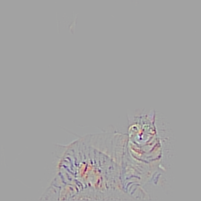

# chainer-grad-cam

Chainer implementation of Grad-CAM [1]. This code uses VGG16Layers ImageNet classification model to generate CAM.

## Summery

||Grad-CAM|Guided Backpropagation|Guided Grad-CAM|
|:-:|:-:|:-:|:-:|
|Boxer (242)||||
|Tiger Cat (282)||||

## Requirements

- Chainer
- Cupy (for GPU support)
- OpenCV

## Usage
```
python run.py --input images/dog_cat.png --label 242 --layer conv5_3 --gpu 0
python run.py --input images/dog_cat.png --label 282 --layer conv5_3 --gpu 0
```

## References

- [1] Ramprasaath R. Selvaraju, Abhishek Das, Ramakrishna Vedantam, Michael Cogswell, Devi Parikh, Dhruv Batra,
"Grad-CAM: Why did you say that? Visual Explanations from Deep Networks via Gradient-based Localization",
https://arxiv.org/abs/1610.02391
